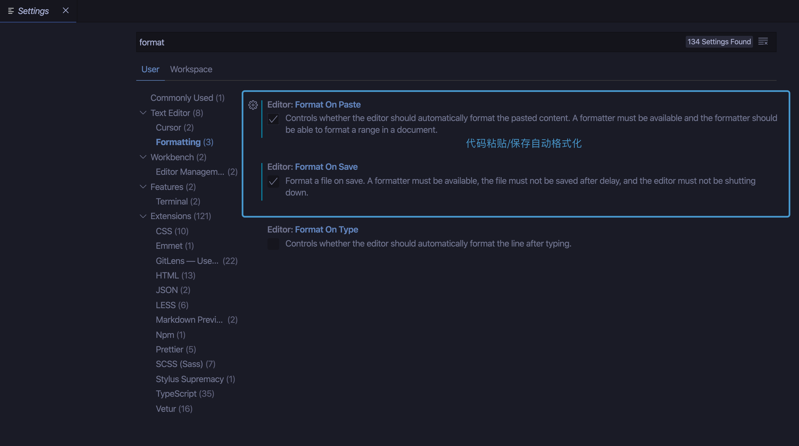
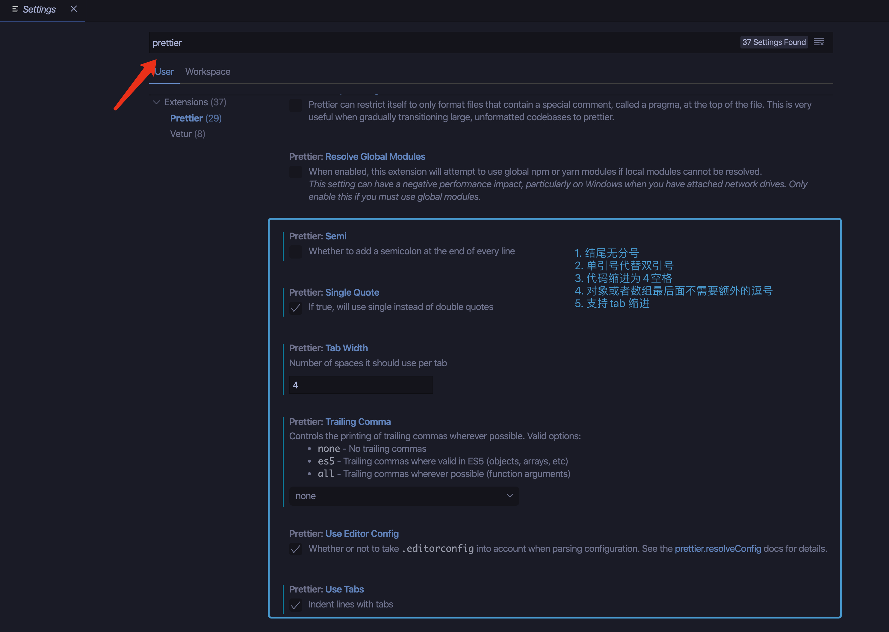

# FE

# 前端技术规范

## 代码管理

前端代码统一使用 git 管理，git 学习推荐 [git 教程](https://www.liaoxuefeng.com/wiki/896043488029600)

[代码提交规范](git-guide.md)

## 开发工具

[Visual Studio Code](https://code.visualstudio.com/)

推荐安装插件：[常用插件](https://www.jianshu.com/p/3eebde5748a6)

## 代码规范

参考百度 ecome 编码规范和 airbnb 的编码规范进行了一些调整。

-   [HTML 编码规范](html-guide.md)
-   [JavaScript 编码规范](javascript-guide.md)
-   [Css 编码规范](css-guide.md)
-   [React 编码规范](react-guide.md)
-   [Vue 编码规范](https://cn.vuejs.org/v2/style-guide/)

推荐使用 Prettier 插件 规范代码格式 并配置保存/粘贴自动格式化。

** 注意项 **

-   代码缩进为 4 空格
-   代码结尾无分号
-   对象、数组等最后一项结尾不加,
-   字符串使用单引号替代双引号

### 代码规范 Todo

-   ES6 编码规范
-   小程序编码规范
-   electron 编码规范
